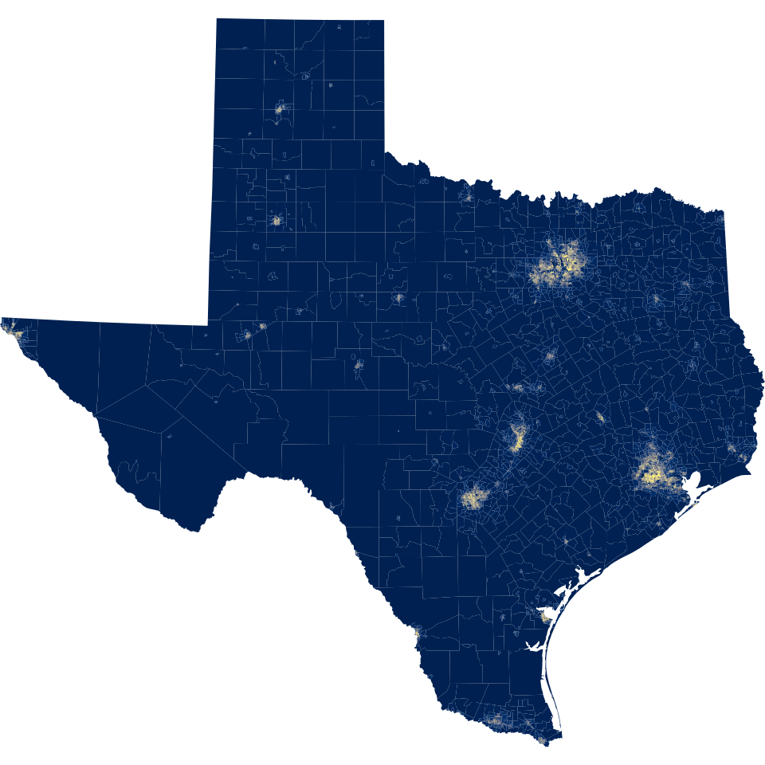
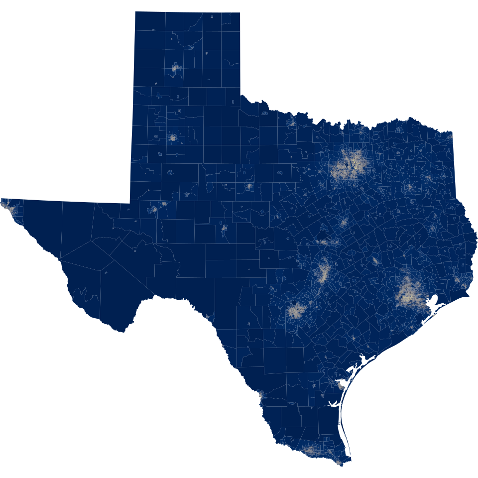
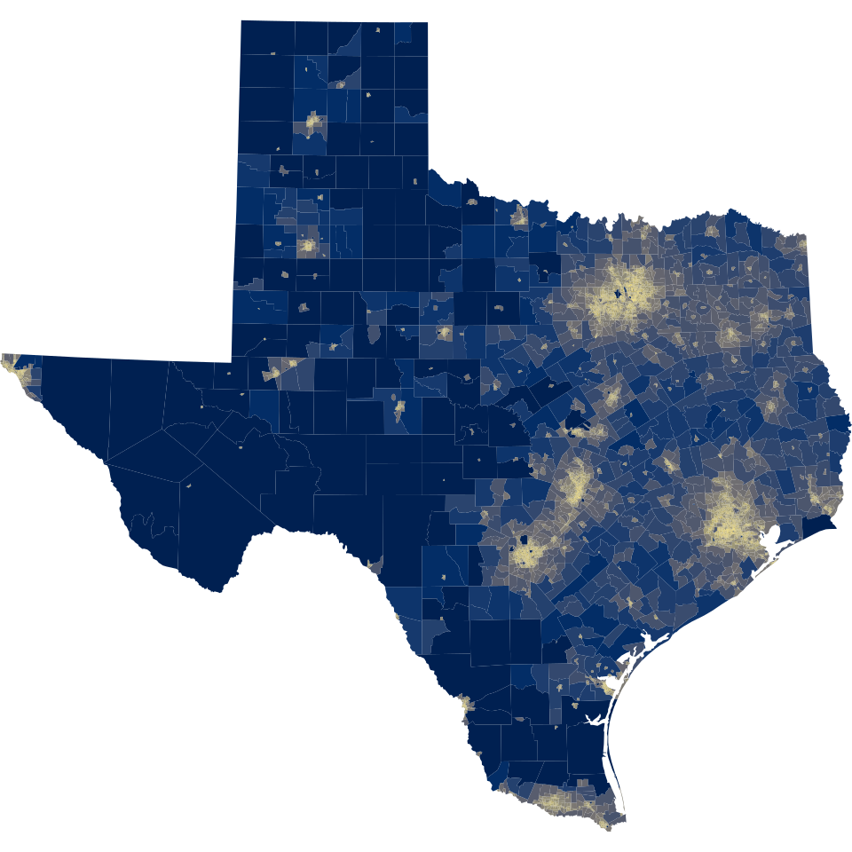
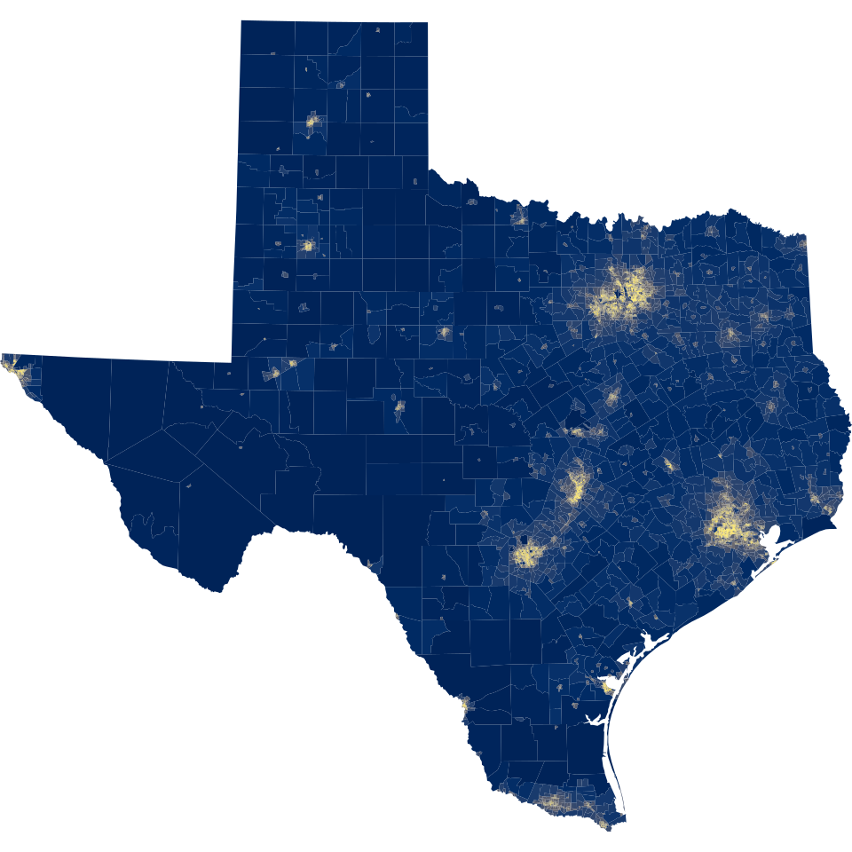
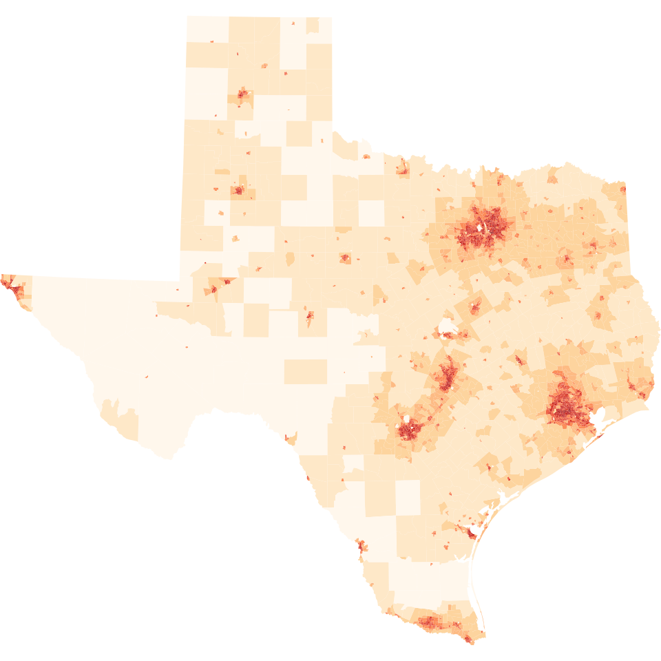
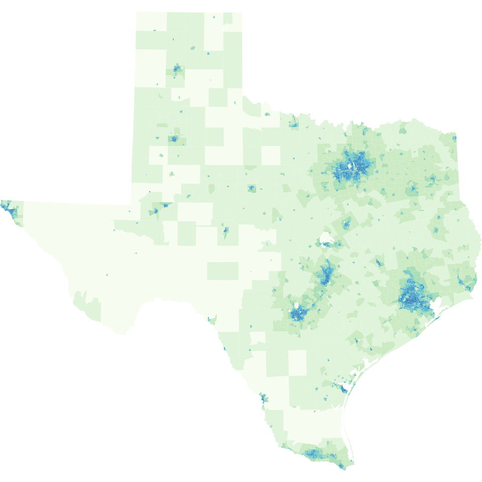
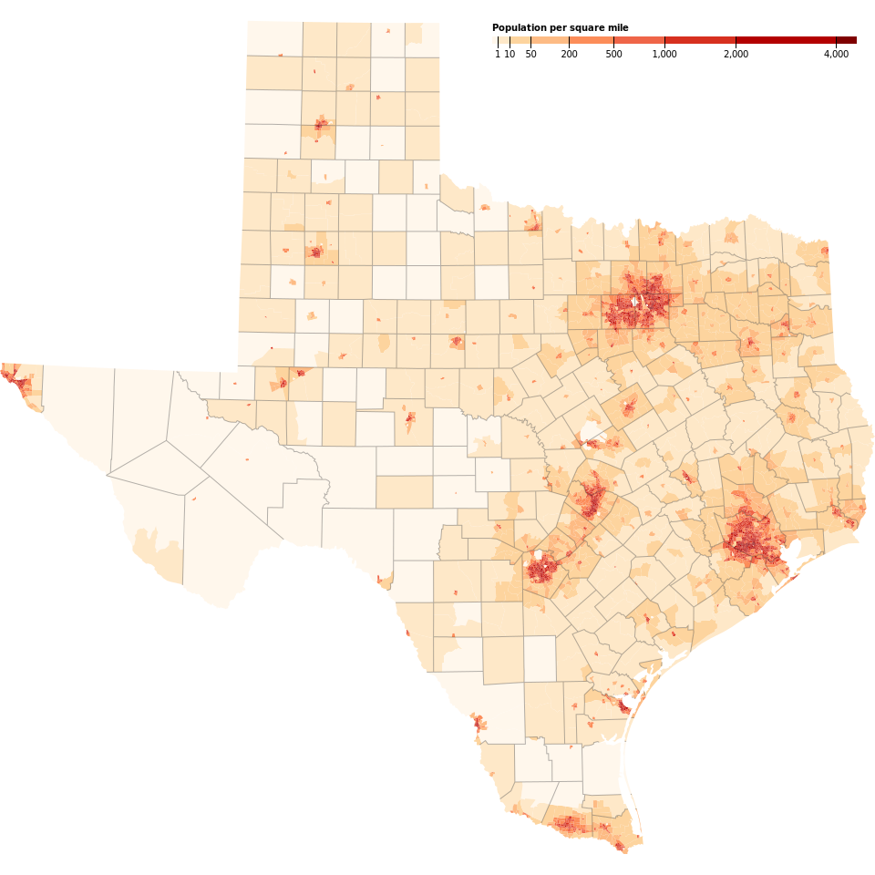

# Texas Choropleth

This document outlines the steps specified in Mike Bostock's [Command Line Cartography](https://medium.com/@mbostock/command-line-cartography-part-1-897aa8f8ca2c) walkthroughs, but relevant to Texas rather than California. It assumes all of the installed tools outlined at the beginning of the [README](../readme.md).

1. Acquire Shape Data and Unzip

```
curl "https://www2.census.gov/geo/tiger/GENZ2014/shp/cb_2014_48_tract_500k.zip" -o source\cb_2014_48_tract_500k.zip

7z e source\cb_2014_48_tract_500k.zip
```

2. Convert shapefile to GeoJSON

```
shp2json source\cb_2014_48_tract_500k.shp -o data\tx.json
```

3. Apply projection

```
geoproject "d3.geoConicConformal().parallels([30 + 70 / 60, 31 + 53 / 60]).rotate([100 + 20 / 60, 0]).fitSize([960, 960], d)" < 
data\tx.json > data\tx-albers.json
```

4. Generate preview

```
geo2svg -w 960 -h 960 < data\tx-albers.json > images\tx-albers.svg
```

[](./images/tx-albers.svg)

5. Split features into ndjson

```
ndjson-split "d.features" < data\tx-albers.json > data\tx-albers.ndjson
```

6. Append `id` to features ndjson

```
ndjson-map "d.id = d.properties.GEOID.slice(2), d" < data\tx-albers.ndjson > data\tx-albers-id.ndjson
```

7. Download the Total Population Estimate, filtered by Texas (FIPS 48)

```
curl "https://api.census.gov/data/2014/acs/acs5/profile?get=DP02_0001E&for=tract:*&in=state:48&key=4c66d1d462c6ea53f7e506d3656fb61b7cd7d2f4" -o data\cb_2014_48_tract_B01003.json
```

8. Join population data to geometry using ndjson-join

```
ndjson-join "d.id" data\tx-albers-id.ndjson data\cb_2014_48_tract_DP02_0001E.ndjson > data\tx-albers-join.ndjson 
```

9. Compute population density using ndjson-map and remove unnecessary properties

> Note that the constant **2589975.2356** = <strong>1609.34<sup>2</sup></strong> converts the land area from square meters to square miles.

```
ndjson-map "d[0].properties = {density: Math.floor(d[1].DP02_0001E / d[0].properties.ALAND * 2589975.2356) }, d[0]" < data\tx-albers-join.ndjson > data\tx-albers-density.ndjson
```

10. Convert back to GeoJSON using ndjson-reduce and ndjson-map

```
ndjson-reduce < data\tx-albers-density.ndjson | ndjson-map "{type: \"FeatureCollection\", features: d}" > data\tx-albers-density.json
```

or simply with ndjson-reduce:

```
ndjson-reduce "p.features.push(d), p" "{type: \"FeatureCollection\", features: []}" < data\tx-albers-density.ndjson > data\tx-albers-density.json
```

11. Define a fill property using a sequential scale with the Viridis color scheme

```
ndjson-map -r d3 "(d.properties.fill = d3.scaleSequential(d3.interpolateViridis).domain([0, 3200])(d.properties.density), d)" < data\tx-albers-density.ndjson > data\tx-albers-color.ndjson
```

12. Generate a preview image using geo2svg

```
geo2svg -n --stroke none -p 1 -w 960 -h 960 < data\tx-albers-color.ndjson > images\tx-albers-color.svg
```

[](./images/tx-albers-color.svg)

13. Convert to TopoJSON

```
geo2topo -n tracts=data\tx-albers-density.ndjson > data\tx-tracts-topo.json
```

14. Simplify Topology

> The `-p 1` argument tells **toposimplify** to use a planar area threshold of one square pixel. This is appropriate because a projection was already applied. If simplifying *before* projecting, use `-s` and specify a minimum-area threshold in [steradians](https://en.wikipedia.org/wiki/Steradian) instead. The `-f` says to remove small, detached rings - little islands, but not contiguous tracts - further reducing the output size.

```
toposimplify -p 1 -f < data\tx-tracts-topo.json > data\tx-simple-topo.json
```

15. Quantize and delta-encode topology

```
topoquantize 1e5 < data\tx-simple-topo.json > data\tx-quantized-topo.json
```

16. Derive County Geometry Using topomerge

> The `-k` argument defines a *key* expression that **topomerge** will evaluate to group features from the *tracts* object before merging. The first three digits of the census tract `id` represent the state-specific part of the county FIPS code, so the census tracts for each county will be merged, resulting in county polygons. The result forms a new *counties* object on the output topology.

```
topomerge -k "d.id.slice(0, 3)" counties=tracts < data\tx-quantized-topo.json > data\tx-merge-topo.json
```

15. Remove External County Borders

> The `-f` expression is evaluated for each arc, given the arc's adjacent polygons *a* and *b*. By convention, *a* and *b* are the same on exterior arcs, and thus we can overwrite the *counties* object with a mesh of the internal borders.

```
topomerge --mesh -f "a !== b" counties=counties < data\tx-merge-topo.json > data\tx-topo.json
```

16. Generate a Scale Interpolated SVG Representation

```
topo2geo tracts=- < data\tx-topo.json | ndjson-map -r d3 "z = d3.scaleSequential(d3.interpolateCividis).domain([0, 3200]), d.features.forEach(f => f.properties.fill = z(f.properties.density)), d" | ndjson-split "d.features" | geo2svg -n --stroke none -p 1 -w 960 -h 960 > images\tx-tracts-color.svg
```

[](./images/tx-tracts-color.svg)

> Census tracts generally have a population size between 1,200 and 8,000 people, with an optimum size of 4,000 people. A census tract usually covers a contiguous area; however, the spatial size of census tracts varies widely depending on the density of settlement.
>
> - [Census Bureau](https://www.census.gov/geo/reference/gtc/gtc_ct.html)

The strong negative correlation between land area and population density is why the majority of the state is blue, dense urban areas are the brightest yellow, and very little exists in-between. The transition from low-density to high-density happens too quickly.

A non-linear transform to distribute colors more equitably is needed, making low-density areas brighter and high-density areas darker.

17. Implement an Exponential Transform

```
topo2geo tracts=- < data\tx-topo.json | ndjson-map -r d3 "z = d3.scaleSequential(d3.interpolateCividis).domain([0, 100]), d.features.forEach(f => f.properties.fill = z(Math.sqrt(f.properties.density))), d" | ndjson-split "d.features" | geo2svg -n --stroke none -p 1 -w 960 -h 960 > images\tx-tracts-sqrt.svg
```

[](./images/tx-tracts-sqrt.svg)

18. Compare to Log Transform

```
topo2geo tracts=- < data\tx-topo.json | ndjson-map -r d3 "z = d3.scaleLog().domain(d3.extent(d.features.filter(f => f.properties.density), f => f.properties.density)).interpolate(() => d3.interpolateCividis), 
d.features.forEach(f => f.properties.fill = z(f.properties.density)), d" | ndjson-split "d.features" | geo2svg -n --stroke none -p 1 -w 960 -h 960 > images\tx-tracts-log.svg
```

[](./images/tx-tracts-log.svg)

19. Compare to Quantile Transform

> This encoding shows variation even within the most dense urban areas. However, it lacks the mathematical simplicity of the square root transform, so it's harder to reason what the colors mean beyond "more" or "less".

```
topo2geo tracts=- < data\tx-topo.json | ndjson-map -r d3 "z = d3.scaleQuantile().domain(d.features.map(f => f.properties.density)).range(d3.quantize(d3.interpolateCividis, 256)), d.features.forEach(f => f.properties.fill = z(f.properties.density)), d" | ndjson-split "d.features" | geo2svg 
-n --stroke none -p 1 -w 960 -h 960 > images\tx-tracts-quantile.svg
```

[](./images/tx-tracts-quantile.svg)

20. Apply a Discrete Color Scheme

> A discrete color scheme is where contiguous ranges of values share colors. This makes it easier for readers to match the color of an area in the map with a specific value using a key. It also means you can manually pick suitable thresholds (breaks) in the color scale.

```
topo2geo tracts=- < data\tx-topo.json | ndjson-map -r d3 -r d3-scale-chromatic "z = d3.scaleThreshold().domain([1, 10, 50, 200, 
500, 1000, 2000, 4000]).range(d3.schemeOrRd[9]), d.features.forEach(f => f.properties.fill = z(f.properties.density)), d" | ndjson-split "d.features" | geo2svg -n --stroke none -p 1 -w 960 -h 960 > images\tx-tracts-threshold-orrd.svg
```

[](./images/tx-tracts-threshold-orrd.svg)

> You can use any of the schemes specified by [d3-scale-chromatic](https://github.com/d3/d3-scale-chromatic)

```
topo2geo tracts=- < data\tx-topo.json | ndjson-map -r d3 -r d3-scale-chromatic "z = d3.scaleThreshold().domain([1, 10, 50, 200, 
500, 1000, 2000, 4000]).range(d3.schemeGnBu[9]), d.features.forEach(f => f.properties.fill = z(f.properties.density)), d" | ndjson-split "d.features" | geo2svg -n --stroke none -p 1 -w 960 -h 960 > images\tx-tracts-threshold-gnbu.svg
```

[](./images/tx-tracts-threshold-gnbu.svg)

21. Add County Borders

```
(topo2geo tracts=- < data\tx-topo.json | ndjson-map -r d3 -r d3-scale-chromatic "z = d3.scaleThreshold().domain([1, 10, 50, 200, 500, 1000, 2000, 4000]).range(d3.schemeOrRd[9]), d.features.forEach(f => f.properties.fill = z(f.properties.density)), d" | ndjson-split "d.features" & topo2geo 
counties=- < data\tx-topo.json | ndjson-map "d.properties = {\"stroke\": \"#000\", \"stroke-opacity\": 0.3}, d") | geo2svg -n --stroke none -p 1 -w 960 -h 960 > images\tx.svg
```

[](./images/tx.svg)